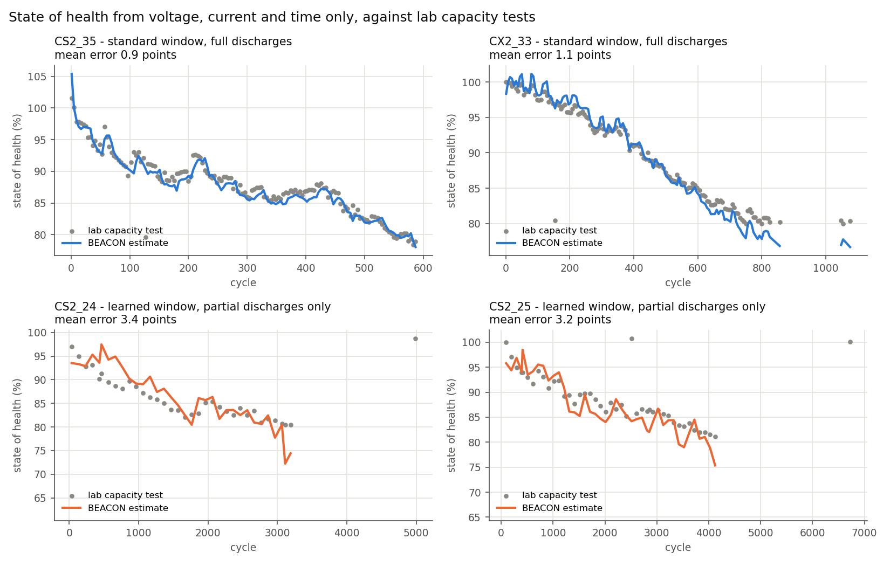
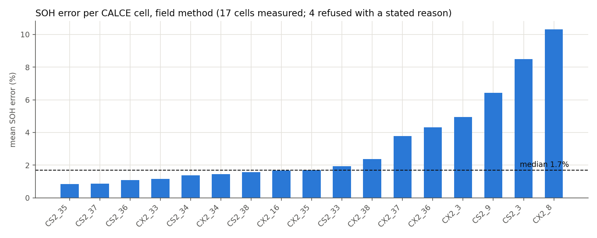
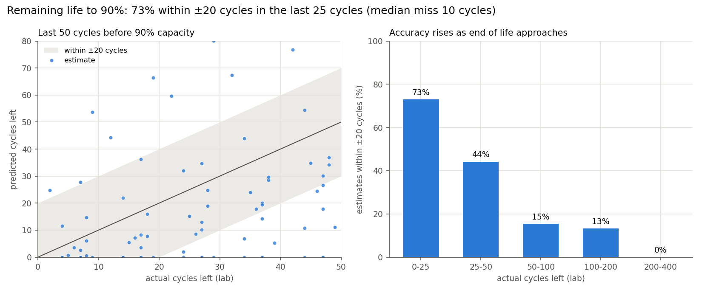

# BEACON — Behavior-Aware EV Battery Monitoring

A three-tier telemetry system that ingests battery data from a **CAN bus**, a
**USB serial rig**, or **research datasets**, converges all three on one schema,
and scores them through one shared pipeline into health, risk and
remaining-useful-life estimates — served over a REST API to a React dashboard.

Written in Python (FastAPI, pandas, scikit-learn), Node (Express), React (Vite)
and C++ (Arduino firmware). ~27,500 lines, 39 test modules, 9-job CI, containerised.

It ships two estimators that **fit nothing across cells** — SOH from charge in a
fixed voltage window, measured from **voltage, current and time alone** (1.7%
median error on 17 of 22 CALCE cells), and RUL from a cell's own fade trend
(within ±20 cycles 73% of the time near end of life) — because the fitted
models measurably do not transfer across protocols. Both run inside the main
pipeline and feed a plain-language **health report card**. See
[The research half](#the-research-half).

## Results

Real CALCE lithium-ion cells. BEACON sees only voltage, current and time; the
lab's capacity tests are used only to score it. Every chart is generated by
`python scripts/export_results.py` from committed artifacts.



| | result |
|---|---|
| State of health, full discharges | **1.7% median error**, 17 of 22 cells |
| State of health, partial discharges only | **3.2–3.4% error**, 2 cells of real top-of-charge cycling |
| Remaining life, last 25 cycles before 90% | **73% within ±20 cycles**, median miss 10 cycles |
| Remaining life as a user sees it | when it predicts under 25 cycles, the cell lasted **at least that long 95% of the time**: a safe lower bound |
| Internal resistance (power fade), from the load step | tracks the lab cycler's own resistance on **19 of 20 cells** (median correlation 0.86) |
| Bench rig, live capture | **83/83 frames** decoded, 1.000 s cadence |

**On battery types it was never tuned for** (same estimator, nothing re-fitted):

| Dataset | Cells | Result |
|---|---|---|
| Oxford, NMC/LCO pouch, 40 °C | 8 | **3.0%** median error; a real drive-cycle discharge read within 1.4% of a constant-current one |
| LG M50T 21700 (Imperial), held out until the final test | 8 | **2.3–2.8%** at cell temperatures of 32–46 °C |
| NASA 18650, warm (43 °C) | 4 | **1.7%** |
| NASA 18650, cold (4 °C) | 7 | **12–14%**: a known weakness; these readings are now labelled LOW with the reason |

**What does not work yet**, each recorded with its test in the validation matrix:
- **Cold accuracy.** Two fixes were tried; neither passed.
- **Confidence.** It measures how much readings scatter, so a steady error can hide from it. A check for this failed its deciding test.
- **Early remaining life.** Two pre-registered attempts failed, so BEACON refuses to predict it.

The audit and the plan for all three are in [`docs/weaknesses_audit_and_plan.md`](docs/weaknesses_audit_and_plan.md).

**→ [`docs/validation_matrix.md`](docs/validation_matrix.md)** lists every claim with its data, ground truth, metric, result and status, including the ones that failed or were never tested. The report card opens with an evidence block: what was measured, and for each output whether it is available, at what confidence, or why not.

Every figure on the report card now carries its validation error band ([`error_bands.csv`](reports/metrics/error_bands.csv)). Ablations and a shuffle control for the benchmark are in [`ablation/`](reports/metrics/ablation/ablation_report.md); `python scripts/panel_demo.py` runs a real rig capture through every stage and injects each fault a reviewer asks for.





## Demo

A recorded walkthrough of the running system — pipeline, dashboard and the
serial rig.

<video src="https://github.com/Navvu-gityhub/Behavior-Aware-BMS/raw/main/docs/media/beacon_demo.mp4" controls muted playsinline width="100%"></video>

*(If the player does not load, [download or view `docs/media/beacon_demo.mp4`](https://github.com/Navvu-gityhub/Behavior-Aware-BMS/raw/main/docs/media/beacon_demo.mp4).)*

What the rig captures in [`data/interim/`](data/interim/) actually contain —
every figure below is computed from the committed files, not quoted from memory:

| Capture | Channels the board declared | Records | Cadence | Measured |
|---|---|---|---|---|
| [`rig_stage_b_voltage_verified.txt`](data/interim/rig_stage_b_voltage_verified.txt) | `t`, `v`, `i`, `soc` — INA219 up, LM35 refused | 83 over 82 s | 1.000 s, 0 gaps, monotonic | 3.9871 V (sd 1.9 mV); current at the ±0.4 mA noise floor |
| [`rig_demo.txt`](data/interim/rig_demo.txt) | `t`, `tc` — LM35 up, INA219 refused | 85 over 84 s | 1.000 s, 0 gaps, monotonic | 32.11 °C (sd 0.086 °C) |

Note the second column. The two sensors have **never been up at the same
time**, and neither capture pretends otherwise: the firmware probes each sensor
at boot, emits a status line naming what failed, and declares in its `HELLO`
only the channels it can actually supply. The host then scores the channels
present and refuses the rest by name. That is the refusal design of this
codebase running on real hardware against its own missing sensor — which is a
better test of it than a capture where everything worked.

The same records, decoded into a spreadsheet with per-channel summary statistics:
**[`BEACON_Hardware_Telemetry_Log.xlsx`](BEACON_Hardware_Telemetry_Log.xlsx)**.

### Each battery's memory, live

Every telemetry run teaches that battery's own profile. The profile keeps a few
numbers per discharge (window charge, resistance, current, temperature), not
the raw log. It answers through the same validated estimator: a test holds it
equal to the whole-log answer, whether fed whole, in pieces, or across a
restart. The `/memory` page shows, for each battery:

- health over discharges;
- resistance growth;
- the measured cell temperature of every reading;
- confidence, with its reason;
- how many later discharges could not be measured, and why.

```powershell
# Windows PowerShell, from the repo folder
python scripts\demo_battery_memory.py                 # real cells: NASA 43/24/4 C, CALCE, LG 21700
$env:BEACON_PROFILE_DIR="data\interim\profiles"
python -m uvicorn src.bms.api.app:app --port 8000      # then open http://127.0.0.1:8000/memory
```

The demo script needs the downloaded datasets (see each `fetch_*` / `run_*`
script). `POST /profiles/{id}/ingest` teaches a profile from a CSV log with
columns `test_time_s`, `current_a`, `voltage_v` and optionally
`temperature_c`. A ten-minute panel walkthrough: [`docs/demo_guide.md`](docs/demo_guide.md).

---

## Quickstart

```bash
git clone https://github.com/Navvu-gityhub/Behavior-Aware-BMS.git
cd Behavior-Aware-BMS
pip install -r requirements-dev.txt

python main.py                        # end-to-end run → dashboard.html
python scripts/run_serial_demo.py     # rig → parser → gate → Guardian
python scripts/health_report.py --serial data/interim/rig_stage_b_voltage_verified.txt
python -m pytest tests/ -q            # the suite
```

With CALCE downloaded, `python scripts/health_report.py --calce
data/raw/calce/CS2/Type2/CS2_35.zip --upto-cycle 90` prints a real cell's report
card as it read at cycle 90, then what the lab measured afterwards — see
[A real report card](#a-real-report-card).

No hardware, no database, no API keys, no dataset download. Every command above
runs on a fresh clone. On Linux/macOS `make pipeline`, `make serial-demo`,
`make check` are shorthands for the same things; `docker compose up` brings all
three services (API `:8000`, gateway `:5000`, client `:5173`).

---

## The idea that shaped the codebase

Most monitoring systems, asked for a number they cannot compute, return a
plausible one. This one refuses, and says why:

```
$ python scripts/run_serial_demo.py --replay capture.txt

serial_rig: REFUSED
  frames read: 246, decoded: 244
  stages completed: ['read', 'parse', 'segment_cycles']
  2/2 discharges usable for SOH (100%); 0 partial. Largest observed discharge 1.976 Ah.
  REFUSED: Scoring skipped: no rated capacity is known for this cell, so
  C-rate cannot be computed. `aggressive_discharge_event` and
  `fast_charge_flag` are current divided by rated capacity, and the risk,
  health and RUL figures are all derived from them. A 3.4 Ah cell scored
  against an assumed 2.0 Ah would read 1.7 C while drawing 1 C and would
  trip both flags on every row of the capture. Declare `capacity_ah` in the
  rig's HELLO line, or pass `rated_capacity_ah`.
  244/244 data records accepted (100%); 1 status record(s).
```

*(Line-wrapped for width; otherwise verbatim.)*

Note what still ran. Segmentation and coulomb counting do not divide by
capacity, so they are reported; only the part that would be wrong is withheld.
Refusals are values, not exceptions — they are returned in the result, rendered,
and reflected in the process exit code so a bench script can branch on them.

This is not defensive coding as a style preference. It is the direct response to
a shipped defect: a missing temperature channel was being scored as *"temperature
is fine"*, because a NumPy comparison against `NaN` evaluates to `False`, so
every heat check silently passed for a pack nobody had measured. Nine of the
system's gates exist to make a specific version of that impossible.

**→ [`docs/architecture.md`](docs/architecture.md)** traces a request end to end
and explains the seams.

---

## What's in here

| | |
|---|---|
| **`src/bms/`** | 20 packages: telemetry ingest, feature extraction, risk, health, RUL, digital twin, conformal prediction, explainability, benchmarks |
| **`src/bms/api/`** | FastAPI service — scoring, telemetry ingest, fleet store |
| **`mern/`** | Express gateway + React/Vite client (fleet table, twin panel, telemetry replay, thermal map) |
| **`firmware/beacon_rig/`** | Board-agnostic Arduino sketch — ESP32 / ESP8266 / AVR, sensors behind four swappable stubs |
| **`tests/`** | 33 modules, including prose-to-evidence pinning and cross-artifact structural tests |
| **`docs/adr/`** | 14 architecture decision records, including the ones that were reversed |

### Engineering worth a look

- **[`docs/architecture.md`](docs/architecture.md)** — the transport→schema→scoring design, and why the scoring tail was *extracted* rather than copied.
- **[`.github/workflows/tests.yml`](.github/workflows/tests.yml)** — one job uninstalls the optional CAN dependency and re-runs the suite, because "it's optional" is otherwise an untested claim. Another reproduces the headline study end to end.
- **[`tests/test_reported_numbers.py`](tests/test_reported_numbers.py)** — every figure quoted in the docs is tied to the artifact that produced it. Re-run an experiment, forget to update a paragraph, fail the build.
- **[`docs/adr/0014-rated-capacity-on-the-wire.md`](docs/adr/0014-rated-capacity-on-the-wire.md)** — a silent 2.0 Ah default found by audit before any hardware was connected, and what removing it cost.
- **[`Dockerfile`](Dockerfile)** — multi-stage, compiler confined to the build stage, non-root UID, healthcheck that is explicitly *service* liveness and not battery health.

---

## Running it

| What | Plain Python (works anywhere) | `make` shorthand |
|---|---|---|
| Dependencies | `pip install -r requirements-dev.txt` | `make install-dev` |
| End-to-end run → `dashboard.html` | `python main.py` | `make pipeline` |
| API on `:8000`, docs at `/docs` | `python -m uvicorn src.bms.api.app:app --reload` | `make api` |
| Emulated rig → Guardian | `python scripts/run_serial_demo.py` | `make serial-demo` |
| Record a session while scoring it | `python scripts/run_serial_demo.py --capture s.txt` | `make serial-capture` |
| Test suite | `python -m pytest tests/ -q` | `make test` |
| Everything CI runs | `ruff check src tests scripts main.py && mypy && pytest tests/` | `make check` |
| All three services | `docker compose up` | `make docker-up` |

The serial demo needs no hardware and no `pyserial`: the emulator generates
byte-for-byte wire output — including an ESP32 boot banner — through the same
parser, checksum and coverage gate a physical board's output would take.
Swapping in real hardware changes one constructor call.

**→ [`docs/protocol_design.md`](docs/protocol_design.md)** — the three protocol
stacks, the wire format, error-detection analysis, and measured channel
utilisation.
**→ [`docs/hardware_design.md`](docs/hardware_design.md)** — the instrumentation
design: component selection, shunt sizing, pin assignment, power budget, and a
measurement error budget carried through to capacity accuracy.
**→ [`docs/hardware_integration.md`](docs/hardware_integration.md)** — wire
protocol, the bring-up record with measured figures, what the first real board
exposed, and what remains untested.

---

## A real report card

What the project set out to give a user — how healthy the battery is, how long
it has left, what usage is doing to it, what to do — for CALCE cell CS2_35 as it
would have read at cycle 90. The pipeline saw voltage, current and time only.
Abridged from `scripts/health_report.py`:

```
1. HOW HEALTHY IT IS
   91.0% state of health  [MEASURED]
   State: WARNING
2. HOW LONG IT HAS LEFT
   About 5 cycles until it falls to 90% of its early capacity.  [ESTIMATE]
3. WHAT YOUR USAGE IS DOING TO IT
   No temperature was measured, so heat exposure ... cannot be assessed.
4. WHAT TO DO
   Capacity fade is measurable. Keep monitoring; replacement is not yet indicated.
   General industry guidance, NOT confirmed by this project's data: ...
5. WHAT THIS REPORT CANNOT TELL YOU
   - Scoring skipped: the feature layer requires channels this source does not supply ...

CHECK AGAINST THE LAB  (the card above was not shown any of this)
   Cycler-measured capacity at cycle 90: 91.4% of initial; the card said 91.0% (-0.3 points)
   The cell actually crossed 90% at cycle 146: 56 cycles after cycle 90; the card said 5
```

The health figure is within a third of a point. The remaining-life figure is 51
cycles early — the conservative bias the RUL study measured at that distance
(median −32 cycles at 50–100 out), which is why the card prints its own
accuracy beside the number rather than the number alone.

Only temperature is offered as a usage finding, because it is the one
behaviour→ageing link that survived testing (7 of 7 NASA cells, direction
only). Fast-charge and state-of-charge advice is printed, and labelled as not
confirmed by this project's data.

---

## The research half

BEACON started as a battery-degradation study. The fitted models did not
transfer across protocols, that was measured rather than assumed, and the two
estimators that now work were built to route around it.

### What does not work, and how thoroughly

- The obvious target, `capacity_loss`, is **96% measurement noise** — an
  isotonic signal fraction of 0.044 is the *maximum attainable* R², which
  retroactively explains every "R² ≈ 0" result the project had recorded.
- **Every method loses skill under leave-one-cohort-out**, across four dataset
  framings, without exception. Selecting a model by leave-one-*cell*-out
  — what most papers report — picks a worse model under protocol shift.
- **No LOCO ranking is supportable at all.** Bootstrapping over folds, every
  interval spans zero and every interval overlaps every other one: XGBoost's
  LOCO R² is 0.459 with a 95% CI of [−2.803, 0.856]. Six ranking claims were
  withdrawn on that basis. The benchmark table now ships its intervals, because
  a project that diagnoses overclaiming from point estimates should not print
  them.
- **Curve features do not rescue it.** Severson's ΔQ(V) variance and ICA peak
  features were added to the same rows, same cells, same gate — one of four
  methods improved, none by more than fold-to-fold noise, and the collapse is
  unchanged. So it is not attributable to the features being usage aggregates.

### What works

Both estimators fit **nothing across cells**, which is why neither can suffer
the collapse above — there is no training cohort to transfer from.

| | result | scope |
|---|---|---|
| **SOH**, field method: voltage, current, time only | **1.7% median error** (95% CI 1.4–4.3%), worst 10.3% | 17 of 22 CALCE cells; 5 refused with a stated reason |
| **SOH from partial discharges only**, window learned from the cell's own usage | **3.2–3.4% error** | real top-of-charge partial cycling, 2 CALCE cells; near-empty partials refused (2 cells) |
| **RUL** by extrapolating a cell's own fade trend | **within ±20 cycles, 73%** of the time | inside 25 cycles of end of life, against the reference a BMS can hold |

**The field method** ([`calce_field_soh/`](reports/metrics/calce_field_soh/field_soh_report.md))
gives the estimator only what a vehicle BMS has. It segments the discharges
itself, and it estimates the cell's resistance from the voltage drop when load
switches on, instead of reading the cycler's resistance column. On the same
cells:

| ohmic correction | cells measured | median error |
|---|---|---|
| none | 12 of 22 | 4.3% |
| cycler's resistance column (lab only) | 12 of 20 | 1.4% |
| **resistance from the load step (field)** | **17 of 21** | **1.7%** |

The step estimate reads higher than the cycler's (~0.165 vs ~0.099 Ω on CS2_35)
because it captures polarisation as well as pure ohmic drop — which is closer
to the sag the window actually sees, and why it measures more cells.

The five refusals are each explained by the code: four dynamic-profile cells
(CALCE Types 5/6) did 80–155 equivalent full cycles before any constant-current
discharge crossed the window, so no "as new" reference exists; one (CS2_7)
never rests before a discharge, so its resistance cannot be estimated. The
three worst measured cells (6.4–10.3%) are all Type 3, which switches rate six
times per cycle.

**Two figures were corrected downward by the field work.** The earlier 3.3% SOH and
88% RUL were scored against a reference capacity taken from each cell's whole
life — the future, which no BMS has. Against the cell's own first cycles, RUL
near end of life is 73% within ±20; the earlier figures stay in their
artifacts as what they were.

**Partial discharges** ([`calce_partial_soh/`](reports/metrics/calce_partial_soh/partial_soh_report.md)).
A car rarely discharges across a fixed 3.90–3.60 V window. CALCE's Type 5 and 6
cells are real partial cycling — thousands of ~25% discharges in one band, with
a full capacity check every ~100 cycles — and neither band crosses that window.
So when the fixed window cannot be read, the pipeline learns one from the
cell's own first ten discharges: the band they all cover, then the flattest
sub-window inside it. Nothing later in life, and no capacity check, informs it.

| cells | band the driver uses | result |
|---|---|---|
| CS2_24, CS2_25 | top of charge, 4.07→3.78 V | **3.4%, 3.2%** error at every capacity check, from partials alone |
| CS2_5, CS2_6 | bottom of charge, 3.69→2.70 V | **refused** — the window would sit on the end-of-discharge knee |

The refusal is physics, not a tuned cut. On the plateau, window charge tracks
capacity; on the knee, voltage is set by resistance and diffusion, so it
measures how hard the cell is working instead. The windows separate by about 9×
in steepness (0.4–0.9 vs 8–10 V per unit state of charge on the flattest
available window), and any threshold between about 0.9 and 8 gives the same
verdict on every cell. Before this gate,
the same estimator reported those two cells at 6.8% and 12.8% error while
looking confident.

As a control, the learned mode on the 18 full-discharge cells measured 16 at
1.95% median — beside 1.7% for the fixed window — so it is a fallback, not a
replacement. **Scope:** two cells per band. That is enough to show the
mechanism and too few to quote a population error.

SOH is the ratio of charge delivered between two fixed terminal voltages now
to the same window early in that cell's life. It survives partial discharge,
which is what a vehicle actually produces, and needs one reference measurement
of the same cell — which production BMS firmware already stores at manufacture.

**Two gates, and the first one was a bug I had misdiagnosed.** The estimator's
worst cell once reported 52% error while looking confident, and I attributed it
to loss of active material breaking the uniform-scaling assumption. **That was
wrong.** CS2_9's late cycles traverse the full 4.07–2.70 V range in ~100 samples
delivering 0.03 Ah, against 1.13 Ah in 3,690 samples early — they are *truncated
discharges*, not a faded cell, and my extractor was reading them as full ones. A
window cannot tell fade from a cut-short cycle, so each cycle is now required to
deliver at least 50% of the reference discharge. That alone took CS2_9 from 52%
to 9% error and CS2_3 from 23% to 10%, and both are now usable rather than
refused. Worst case across all cells: **52% → 10.5%.**

The second gate remains physical: a window ratio below 0.50 means a cell holding
under half its charge, which is scrap rather than degraded, so the reading is
withheld — never clipped into the plausible range. It refuses 3 of 16 cells.
Both checks need no ground truth, which is what lets them run in deployment.

Two literature-backed hypotheses were tested first and **both failed**:
constant-current *charge* curves (worse on four of five cells here, because
CALCE logs the charge leg sparsely) and rate-induced voltage depression
(refuted — the failing and working cells run at the same 0.50C).

**→ [`docs/capability_assessment.md`](docs/capability_assessment.md)** is the
synthesis: what a software layer over a BMS can and cannot do, argued from
these measurements. Its central number is that the 95% interval on one method's
LOCO score is 3.66 R² wide while the entire spread between the best and worst
of 14 methods is 2.06 — so model choice is unresolvable here, while two
data-conditioning fixes moved worst-case error 5×.

**→ [`reports/metrics/calce_voltage_window/`](reports/metrics/calce_voltage_window/)**
and **[`calce_rul_horizon/`](reports/metrics/calce_rul_horizon/)** carry the
per-fold numbers.

Fourteen ADRs record how those conclusions were reached and reversed. Two
document experiments that refuted their own premise.

**→ [`docs/final_report.md`](docs/final_report.md)** is the authoritative
account. **→ [`docs/project_history.md`](docs/project_history.md)** is this
README's previous life, with the full calibration narrative and every figure.

---

## Status

The pipeline, API, gateway, client, container build and CI are working.

The serial path now runs against a **physical board** — a NodeMCU ESP8266 with
an INA219 current/voltage monitor and an LM35 temperature sensor on a single
HONGLI ICR-18650 cell. `SerialPortSource.lines()`, previously the one untested
surface, has carried three captures end to end: board → wire protocol → parser
→ checksum → coverage gate → scoring → dashboard. Timing held at 1.000 s with
no dropped samples in any capture.

Read that result narrowly. It is **one cell, at rest, for under 90 seconds**,
with no load step and no charge/discharge cycle. It demonstrates that the
transport, the protocol, the gate and the refusal path work against real
silicon. It is *not* a validation of the health or RUL models, which were fitted
on cycled research cells and cannot be confirmed or refuted by a cell that was
never cycled. [`docs/hardware_integration.md`](docs/hardware_integration.md)
carries the full bring-up record and the remaining gaps.

**Estimators.** Field SOH and fade-extrapolation RUL run inside
`score_telemetry_frame` on every transport, before and independently of the
behaviour scoring, so a log with no temperature channel still gets its fade
measured. Where measured SOH exists and the log starts at beginning of life it
sets `battery_state`, with `state_basis` recording that it did; otherwise the
heuristic index is used and labelled as such. `compute_rul`'s hand-picked
weighting remains only as a labelled fallback for logs too short to extrapolate.

The conventional 80% end-of-life threshold is validated only as a
conservative bound. CALCE's full-discharge trajectories end near 0.81, so the
CALCE RUL figures are measured at 0.90. On Oxford, whose cells cross 80%,
predictions under 500 cycles were not exceeded 97% of the time, but with low
precision.

Persistence is opt-in: `BEACON_STATE_FILE` for the fleet store,
`BEACON_PROFILE_DIR` for battery profiles. Not done, in dependency order:
structured logging and metrics, a load-test harness, async serial ingest with
backpressure. See [`docs/roadmap.md`](docs/roadmap.md).
