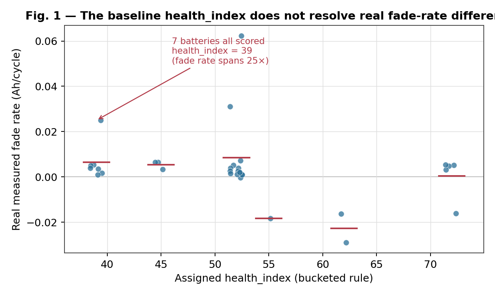
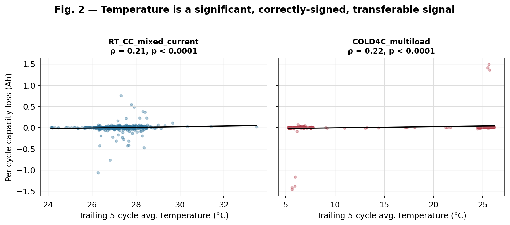
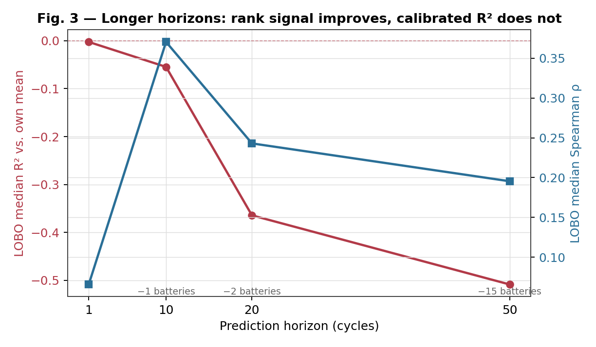

# Behavior-Aware EV Battery Health Monitoring: Final Report

**Author:** Naveen Vaidyanathan
**Date:** 2026-07-22 (Sections 4.10–4.12 added 2026-08-21)

**Note on revision:** Sections 4.10 through 4.12 were added after the original
report and **change how Sections 4.1 through 4.6 should be read**. In short:
every earlier result was measured against a target whose maximum attainable R²
is 0.044, so the recurring "no method beats a constant" finding was
substantially a property of the target rather than of the methods.

Nothing earlier has been retracted or silently edited — each number remains
correct as a statement about `capacity_loss`. What has changed is the scope of
the conclusions drawn from them, and Sections 4.10–4.12 state exactly which
claims narrow and which survive. Where this document and ADR 0007/0008
disagree, the ADRs are authoritative; they were written first and this section
follows them.

**Note on this document:** every number below was executed and verified in
the course of producing this report — nothing is carried over from an
earlier draft without being re-run. An earlier draft of this report existed
in the project workspace with different figures for the Section 4.3
cross-validation results (a mean R² and an interaction-term p-value) that
could not be reproduced when actually re-run; those figures were discarded
rather than kept, and this version reports what re-running the analysis
actually produced. Reproduction commands for every result are in the
Appendix.

---

## Abstract

This project builds a behavior-aware analytics layer over EV battery
telemetry: ingestion, feature extraction, degradation risk scoring, a
health index, remaining-useful-life (RUL) estimation, and a dashboard. The
initial implementation (V1) consisted of a rule-based scoring system with
hand-picked weights and thresholds, entirely unvalidated against real
degradation data. This report documents the calibration effort undertaken
against two real datasets (NASA Li-ion cycling data, 34 cells; CALCE PLN
pouch cells) and its results: the original heuristic scores show no
significant relationship with real capacity fade; one specific behavioral
signal (temperature exposure) does show a real, cohort-controlled,
statistically significant relationship; and a fitted regression model
built on that signal, while statistically valid in-sample, performs no
better than a naive per-battery-average baseline out-of-sample.
Lengthening the prediction horizon (Section 4.5) improves out-of-sample
*rank* correlation but not R² against that baseline. Three further results
were added in the final pass. A threshold-reachability audit (Section 4.7)
found that 61% of the mean risk score comes from terms that are constant
across the entire calibration set, because their hand-chosen cut points sit
outside the range real data occupies — which explains mechanically why the
scores showed no resolution, and reframes the earlier null result as a
calibration-design fault rather than a failure of the behavioural premise.
Leave-one-cohort-out validation (Section 4.8), substituted for a
cross-dataset test that the available CALCE data makes impossible, showed
that the fitted model's apparent battery-ranking ability (rho = 0.84) is
carried almost entirely by its per-cohort intercepts and collapses to
rho = −0.30 on an unseen protocol. An explainability layer (Section 4.9)
replaced the previous threshold-based cause attribution with exact
closed-form Shapley values over the score terms, and a SHAP analysis against
measured fade was gated on out-of-sample skill, which it failed — so its
importance ranking is reported as describing model fitting, not physics. That pointed at the
fixed cohort intercept as the likely cause, but a mixed-effects model
built to test that directly (Section 4.6) is not identifiable with only
3-4 batteries per cohort — closing that modeling line on this dataset and
converting "more data would help" into a concrete acceptance criterion
(~8-10+ batteries per cohort) for whatever dataset comes next.

A final pass (Sections 4.10–4.12) rescoped much of the above. The target used
throughout, per-cycle capacity delta, has a signal fraction of **0.044** — an
R² of 0.044 was the best score obtainable against it, so the recurring null
result was substantially a property of the target. On a well-conditioned
target (`soh`/`cumulative_fade`, ceiling 0.569) four candidates clear the same
gate. A reversible thermal offset in measured capacity — apparent SOH of 0.918
at 4 °C versus 0.999 at 44 °C before degradation is possible — was found to
explain mechanically why temperature predicts fade correctly within cohorts
and backwards across them.

A benchmark of twelve published methods, including a real XGBoost and a real
LSTM, showed that **leave-one-cell-out rank carries essentially no information
about leave-one-cohort-out rank** (Spearman ρ = +0.084, p = 0.795, n = 12) and
that choosing by the former costs 0.309 R². The most robust method in the
table is `age_linear`, a straight line on cycle count: it reaches LOCO
R² = 0.406 against the best model's 0.459, so **all the behavioural modelling
buys about 0.05 R² over counting cycles**.

The picture then replicated on CALCE (Section 4.13) — a second laboratory, a
depth-of-discharge cohort axis rather than a thermal one, 19 cells across 8
cohorts and two cell families. Every method again lost skill under protocol
shift. Which *family* transfers best did not replicate.

By that point five separate ranking claims had been made and withdrawn, so a
designed experiment (Section 4.14, 220 measurements) was run to find out why.
The proposed explanation — that the gap reflects cohort coverage — was
**refuted**: the one dataset showing a significant raw correlation lost it
entirely once training-set size was regressed out. What the experiment did
establish is that the leave-one-cohort-out estimate has an interquartile range
across cohort draws of **0.724 R²**, roughly twice the median difference
between a nonlinear model and a straight line on cycle count (0.351). The
measurement is noisier than the effect it was being used to rank, which is why
every ranking claim failed to replicate.

The defensible conclusion is methodological: *at the sample sizes standard
battery datasets provide, a single leave-one-cohort-out estimate cannot
distinguish between candidate methods and must be reported as an interval.*

The project's main contribution at this stage is not a validated predictive
score — it is a rigorously diagnosed account of what does and doesn't
work, with a concrete, specific path to closing the gap.

---

## 1. Problem Statement

EV battery packs degrade as a function of both electrochemical aging and
user behavior (fast charging, deep discharge, thermal exposure). Battery
Management System (BMS) hardware handles safety but does not typically
explain *how* behavior drives long-term degradation or provide
forward-looking guidance. The goal of this project is a software layer
that:

1. Converts raw BMS telemetry into interpretable behavior features.
2. Scores degradation risk and estimates a health index and RUL from those
   features.
3. Explains the score in plain language and recommends action.
4. Does all of the above with scores that are actually validated against
   measured degradation, not just plausible-sounding.

Item 4 is the part V1 did not have, and this report is primarily about
closing that gap and reporting honestly on how far it got.

## 2. System Architecture

```
raw telemetry (NASA / CALCE / simulated)
        |
schema validation & normalization  (src/bms/preprocessing/)
        |
behavior flags (row-level: aggressive discharge, fast charge, high temp, deep discharge, high SOC)
        |                                        (src/bms/features/)
rolling/age features -> per-battery or per-cycle summary
        |
rule-based risk score + health index (v1) + RUL     (src/bms/risk/, health/, rul/)
        |                                        + fitted health_index_v2 (temperature-only, see Sec 4.3)
guardian report (plain-language causes + recommendation)   (src/bms/guardian/)
        |
HTML dashboard                                      (src/bms/dashboard/)
```

Entry point: `main.py` (simulated data by default, `--data` for a
unified-schema CSV). Full pipeline runs in seconds on simulated data;
NASA's full 7.2M-row dataset takes under a minute to ingest.

## 3. Methodology

### 3.1 Baseline (V1) scoring design

Row-level `stress_score` (0-100) is a weighted sum of five binary behavior
flags (aggressive discharge, fast charge, high temperature, deep discharge,
high SOC), aggregated per battery into `avg_stress`. `health_index` and
`risk_score` are separate bucketed-threshold rules (e.g. `avg_temp > 40:
+25, > 30: +15, else: +5`) applied to the per-battery summary. RUL uses an
"equivalent aging factor" combining health_index with the same underlying
signals again (a known double-counting issue, documented but not yet
resolved — see `src/bms/rul/rul_estimation.py`). All weights and
thresholds were hand-picked during initial development, not fit to data.

### 3.2 Calibration data

- **NASA Li-ion dataset** ("cleaned_dataset" distribution): 34 cells, 7.24M
  telemetry rows, real per-cycle measured discharge capacity. Spans 9
  distinct experimental sub-protocols (different discharge cutoff voltage,
  current, ambient temperature) documented in NASA's own per-batch READMEs
  — treated as a confound to control for, not ignored.
- **CALCE PLN pouch cells**: a calendar-aging (shelf storage) study plus a
  raw Arbin capacity-characterization export. Evaluated and found
  unsuitable for either cycle-fade or calendar-aging calibration (Section
  4.4) — a real, reported negative result rather than a forced fit.
- **Stanford/Severson fast-charging dataset**: identified as the right
  data source for fast-charge-specific validation but not yet acquired
  (deferred; multi-GB raw download, awaiting a smaller/processed variant).

### 3.3 Validation approach

Three escalating levels of rigor, each addressing a limitation found in
the previous one:

1. **Battery-level, pooled**: one point per battery (whole-life average
   behavior vs. whole-life fade rate), all 34 batteries pooled regardless
   of protocol. Simplest, and — as it turned out — confounded.
2. **Cohort-controlled, cycle-level**: batteries grouped by NASA's own
   documented protocol groups; each battery contributes one point per
   cycle (a trailing window of behavior vs. that cycle's actual capacity
   loss), not one point total. Addresses both the protocol confound and
   the information loss from collapsing a whole trajectory into one
   number.
3. **Fitted regression with cohort fixed effects, leave-one-battery-out
   cross-validated**: a continuous model rather than bucketed rules,
   with cohort as an explicit covariate and out-of-sample validation
   rather than in-sample correlation.

All correlations use Spearman's rho with reported p-values and sample
sizes; the regression uses OLS with reported coefficients, standard
errors, and both in-sample and cross-validated fit statistics. No result
in this report is presented without its sample size and significance.

## 4. Results

### 4.1 The baseline heuristic is not validated (Level 1)

None of `health_index`, `risk_score`, or `avg_stress` showed a
statistically significant relationship with real fade rate or
cycles-to-80%-capacity (all p > 0.13, n=24-33, pooled across confounded
protocols). `health_index`/`risk_score` trended in the *wrong* direction
(though not significantly). One real bug was caught and fixed in the
process: `fast_charge_flag` used a flat 2A threshold that never fired on
real data (observed current never exceeded 1.54A); it was replaced with a
C-rate-relative threshold, which is dimensionally correct regardless of
this dataset's specific result.

The bucketed scoring rule also loses resolution independent of whether its
weights are right: joining the pipeline's assigned `health_index` against
each battery's actual measured fade rate (Figure 1) shows 7 of 33 batteries
collapsed onto the identical score of 39 despite a 25× range in real fade
rate between them, and 14 more collapsed onto 52 despite a range that
includes both near-zero and clearly-degrading cells. A rule this coarse
can't distinguish a battery fading 25× faster than another from one that
reports it identically.



### 4.2 Temperature is a real, transferable signal; current-based flags are not (Level 2)

Controlling for protocol via NASA's own documented cohorts and comparing
at cycle resolution: `avg_temp` (trailing 5-cycle window) is a significant,
correctly-signed predictor of capacity loss in two independent cohorts
(ρ=0.21 and ρ=0.22, both p<0.0001), with the correct sign in 7 of 7
individual batteries checked (a check against pseudoreplication from
pooling autocorrelated cycles).



> **Scope narrowed by Section 4.11.** This result holds *within* cohorts and
> should not be read as "transferable", despite this section's original
> heading. Measured capacity carries a large reversible thermal offset —
> apparent SOH is 0.918 at 4 °C and 0.999 at 44 °C at cycle ≤ 20, before
> degradation is possible — which is constant inside a fixed-ambient cohort
> but switches on across cohorts, where it is anti-correlated with real
> thermal aging and reverses the apparent sign. The within-cohort finding
> above stands; the cross-cohort collapse reported in Section 4.8 now has a
> measurement explanation rather than only a statistical one.

The current-based `avg_stress`/
`aggressive_discharge_count` signals do not transfer: significant and
positive in room-temperature cohorts, significant and *negative* in the
4°C cohort. Also found: the coarse bucketed rules have essentially no
resolution even before considering whether the weights are right — 6 of 7
batteries in a clean, single-protocol cohort received the *identical*
health_index despite a 5x range in real fade rate. That pattern holds
across the full dataset too, not just this one cohort — see Figure 1 in
Section 4.1, where 7 of 33 batteries collapse onto a single score despite
a 25x range in fade rate between them.

### 4.3 A fitted model replicates the signal but does not generalize (Level 3)

With cohort as a fixed effect, `trailing_avg_temp` remains significant
(coefficient 0.0038 Ah/°C, p<0.0001) in a pooled OLS regression fit on all
2,682 cycle-level observations across all 9 cohorts. In-sample R² = 0.015
— already low, meaning even the *fitted* line explains little of the
per-cycle variance.

Leave-one-battery-out cross-validation, two complementary metrics:

- **R² against each held-out battery's own mean** (does the model beat
  the simplest possible baseline — "predict this battery's average"?):
  mean **0.0024** across 33 testable batteries, with only **19 of 33**
  (58%) beating that naive baseline at all. Effectively a tie with "assume
  every cycle is average for this battery."
- **Spearman rank correlation** between predicted and actual per-cycle
  capacity loss: median **0.052**, with 24 of 33 (73%) batteries showing a
  positive correlation — directionally more encouraging than the R² view,
  but a weak effect size even where positive.

Both are true simultaneously and are not in tension: the model gets the
*direction* right more often than chance (rank correlation), but the
*magnitude* of its predictions adds essentially no value over a flat
per-battery baseline (R²). For a report, the second framing is the more
important one to lead with, since it's the one a practical deployment
decision would actually depend on.

An interaction test for the Level 2 hypothesis (that cold ambient inflates
the apparent effect of aggressive discharge via internal resistance) was
run directly: `trailing_aggressive_discharge_count × is_cold`, controlling
for cohort. The interaction coefficient is positive (consistent with the
hypothesis) but **not significant at conventional thresholds** (p=0.098,
n=2,682 cycle-observations). A supporting but indirect check using NASA's
impedance (Re/Rct) data found that for the one cohort where impedance was
measured in-situ at the true operating temperature (43°C, rather than
NASA's usual standardized 24°C for EIS), internal resistance was lower
than at 24°C (Re: 0.051 vs 0.059 Ω; Rct: 0.062 vs 0.083 Ω) — consistent
with the general temperature-resistance relationship the hypothesis
depends on, but this doesn't directly confirm the effect at 4°C, since
NASA's 4°C-cohort impedance measurements were taken after re-equilibrating
to 24°C, not in-situ. **Verdict: suggestive, not confirmed.**

This model (`src/bms/health/health_index_v2.py`) is **not** the pipeline's
default and is not used by the dashboard. A statistically significant
in-sample coefficient that performs at-or-near a naive baseline
out-of-sample is not a usable predictor, and shipping it as the primary
score would repeat the exact mistake this calibration effort exists to
correct.

### 4.4 CALCE: real engineering value, zero calibration value

A working loader (`src/bms/io/load_calce_capacity.py`) was built for
CALCE's raw Arbin cycler export format, recovering 138 of 150 cells after
fixing a case-sensitivity bug in a free-text ID-mapping parser that
initially silently captured only 34. Running this data through the
pipeline caught a genuine correctness bug unrelated to CALCE itself:
`compute_risk_assessment`/`compute_health_index` were silently treating
missing data (no temperature channel in this dataset) as "low risk"
because NumPy's NaN comparisons evaluate to False — now fixed to raise
instead. However, the data itself could not support either of the two
calibration questions attempted: it's single-cycle characterization data
(no cycle-fade trajectory), and its "pre-storage" and "post-storage"
capacity values turned out to be the same measurement recorded twice, not
a before/after pair — ruling out a calendar-aging capacity-loss analysis.
Full detail in `docs/calce_dataset_note.md`.

### 4.5 Longer prediction horizons: real gains in rank signal, not in R² (Level 3b)

Section 6 (original draft) proposed the obvious next test: Section 4.3's
model predicts capacity loss one cycle ahead, a target likely dominated by
per-cycle measurement noise. Predicting cumulative loss over a longer
window (10/20/50 cycles) should average that noise down. This was run
(`scripts/fit_horizon_regression_model.py`, reusing the cached Section 4.3
cycle-level table — `trailing_avg_temp` is not horizon-dependent, only the
target is, so no raw-telemetry re-ingestion was needed) and the result is
genuinely mixed, not the clean improvement the hypothesis predicted:

| Horizon (cycles) | In-sample R² | LOBO R² (median) | % beating baseline | Spearman ρ (median) | % positive ρ |
|---:|---:|---:|---:|---:|---:|
| 1  | 0.015 | −0.002 | 36% | 0.066 | 67% |
| 10 | 0.279 | −0.055 | 42% | 0.371 | 79% |
| 20 | 0.464 | −0.365 | 30% | 0.243 | 80% |
| 50 | 0.634 | −0.509 | 28% | 0.195 | 83% |

*Batteries tested: 34 at H=1, 33 at H=10, 32 at H=20, 19 at H=50 — see the
coverage-loss discussion below for which cohorts drop out and why.*



Two findings, and they point in different directions:

- **Rank correlation genuinely improves and generalizes better** with
  horizon: median Spearman ρ roughly triples from H=1 to H=10, and the
  fraction of held-out batteries with the *correct-direction* prediction
  rises from 67% to 79–83%. This is consistent with the noise-averaging
  hypothesis and is a real, if modest, positive result — the model gets
  *which batteries are degrading faster* more right at longer horizons.
- **R² vs. each battery's own mean does not improve — it gets worse.**
  In-sample R² climbing to 0.63 is not evidence the model is 40x better;
  it's what happens when cohort dummies increasingly absorb a target whose
  magnitude scales with horizon, which is a mechanical effect of cumulative
  sums, not a sign the temperature slope became more informative
  out-of-sample. The out-of-sample number that matters gets worse. (An
  early run reported *mean* R² of −24 at H=50 — that number is real but is
  an artifact of a few near-flat-trajectory batteries with SS_tot ≈ 0,
  where any real error explodes into an arbitrarily large negative R² and
  dominates a mean across 18-19 batteries; e.g. B0041 alone scores −402 at
  H=50. Median is the number to read, and it also gets worse with horizon,
  just far less dramatically.)

A confound this experiment cannot rule out: horizon and sample size move
together. At H=50, four of nine cohorts (15 of 34 batteries) are excluded
outright because no cell in them survives 50 more cycles, so the H=50 row
is not a controlled comparison against H=1 — it's a smaller, longer-lived-
battery-skewed sample. The R² degradation could partly be that smaller,
noisier cross-validation folds are inherently less stable, not purely a
horizon effect. This should be checked by holding cohort composition fixed
before drawing a strong conclusion.

**Verdict:** the longer-horizon hypothesis was worth testing cheaply and
was tested cheaply — but it does not resolve Section 4.3's core finding.
The fitted model is still not a usable quantitative predictor (R² against
a naive baseline is still negative, and now more negative than before).
What it adds is evidence that the temperature signal has real, generalizing
*directional* information that a single-cycle regression target was too
noisy to expose — which argues for the per-battery random-effects model in
Section 6 (future item 2, second half — not yet done) rather than for
longer horizons on the current fixed-cohort-intercept model. Reusing
fixed cohort dummies at longer horizons appears to make the intercept
mismatch problem worse, not better, as cumulative-loss magnitude diverges
further between an unseen battery and its cohort-mates.

### 4.6 Mixed-effects model: closed by a data limit, not a modeling failure (Level 3c)

Section 4.5 pointed at a specific culprit for why R² doesn't improve with
horizon: the fixed cohort intercept (9 dummies) is too coarse and
generalizes poorly to a held-out battery. The direct fix from mixed-model
theory is a per-battery random intercept nested within the cohort fixed
effect. This was attempted (`scripts/fit_mixed_effects_model.py`) and is
closed for a specific, checkable reason rather than resolved either way.

Two things worth separating, because only one of them is a data problem:

- **Structural limit, true regardless of data size.** Under
  leave-one-battery-out validation the held-out battery contributes zero
  training rows, so its random intercept is unestimable by definition —
  there's nothing to condition it on. The only prediction available for a
  genuinely unseen battery is the population-level fixed effects, which is
  structurally identical in form to the plain OLS model in Section 4.3. A
  mixed model can only help LOBO performance *indirectly*, via
  better-calibrated fixed effects from correctly modeling within-battery
  autocorrelation during training (plain OLS treats every cycle-row as an
  independent observation, which it isn't).
- **That indirect benefit isn't estimable here.** Four specifications were
  tried (battery random intercept with three different optimizers; battery
  random intercept nested within the cohort fixed effect via a variance
  component). The random-effect variance estimate is either pinned to the
  boundary (~1e-9, i.e. the model degenerates to the existing OLS fit and
  gains nothing) or swings to a non-trivial value (0.017) on an optimizer
  that fails to converge — the signature of a likelihood surface that
  can't identify the parameter from this data, not evidence of a genuine
  near-zero effect. The reason is visible directly in the data: every one
  of the 9 cohorts has exactly 3-4 batteries. That's too few to separate a
  battery-level variance component from cohort and residual variance.

**Full LOBO cross-validation of the mixed model was deliberately not
run.** With an unidentified variance component, the LOBO number would
depend on which optimizer happened to be called, which is not a result —
it would be reporting whichever number the optimizer's initialization
landed on. Running it would have looked more thorough without being more
informative.

**What this closes and what it reopens.** It closes the "try a more
flexible model on the current data" line — that's now been tried at two
levels (fixed cohort-intercept regression, mixed-effects) with a real,
diagnosed reason further attempts on *this* NASA subset won't help. It
reopens Section 5's existing "single dataset" limitation with a sharper,
numeric version: a future dataset needs roughly 8-10+ batteries per
protocol cohort, not 3-4, if a random-effects approach is the goal — a
concrete acceptance criterion for dataset selection rather than "more data
would help," which is worth having when evaluating Stanford/Severson or
CALCE CS2/CX2 as the next dataset.

### 4.7 Threshold reachability: most of the score is a constant (Level 4)

Sections 4.1–4.3 established that the heuristic scores do not correlate with
measured fade. They did not explain *why*. Extracting the score terms into
shared, auditable specifications (Section 4.9) made that question answerable,
and the answer is mechanical rather than conceptual.

`scripts/audit_threshold_reachability.py` compares each term's hand-chosen cut
points against the range its input feature actually occupies in the 2,682
cycle-level NASA observations:

| Term | Feature | Observed range | Bands at | Status |
|---|---|---|---|---|
| stress | `avg_stress` | 1.71 – 33.38 | 50, 70 | **DEGENERATE** |
| fast charge | `fast_charge_duration` | 0.00 – 0.00 | 20, 100 | **DEGENERATE** |
| deep discharge | `deep_discharge_duration` | 77 – 3,768 | 20, 100 | PARTIAL (99.9% in one band) |
| temperature | `avg_temp` | 5.18 – 46.78 | 30, 40 | ACTIVE |
| aggressive discharge | `aggressive_discharge_count` | 0 – 546 | 100, 500 | ACTIVE |
| SOC extremes | `avg_soc` | 0.43 – 68.78 | <20, >80 | ACTIVE (low branch only) |

Two terms never leave a single band, so they emit a constant. Decomposed per
battery across the 33 calibration cells:

| Term | Mean points | Std | Distinct values |
|---|---|---|---|
| stress | 10.0 | 0.0 | 1 |
| deep discharge | 20.0 | 0.0 | 1 |
| fast charge | 2.0 | 0.0 | 1 |
| temperature | 8.6 | 7.4 | 3 |
| aggressive discharge | 11.4 | 5.4 | 3 |
| SOC extremes | 0.3 | 1.7 | 2 |

**Of a mean risk score of 52.3 points, 32.0 points (61%) come from terms that
are identical for every battery in the dataset**, and therefore carry zero
discriminative information.

Two consequences follow.

First, this reframes Section 4.1. The scores did not fail to correlate with
fade because the behavioural hypothesis was wrong. They failed because most of
the score was a constant, and a constant cannot correlate with anything. Those
are different diagnoses with different fixes: the first would call for
abandoning the behavioural premise, the second calls for cut points placed
against observed distributions rather than guessed.

Second, `fast_charge_duration` is identically zero across all 2,682
observations — NASA's protocols contain no charging event this pipeline's
C-rate threshold classifies as fast. The 15-point fast-charge penalty is
therefore not merely unvalidated but **unvalidatable** on this dataset. No
amount of further analysis of NASA can constrain it. Stating that is more
useful than reporting a null result that implies the question was tested.

### 4.8 Leave-one-cohort-out: the fitted model's ranking is cohort memorisation

A cross-dataset test (train NASA, test CALCE) is the standard next step and
**cannot be run** — the supplied CALCE files are single-cycle baseline
characterisations with no fade target (Section 4.4, ADR 0001). Leave-one-cohort-out
(LOCO) across NASA's 9 experimental protocols was substituted. It is a weaker
claim (same laboratory, chemistry and instrumentation) but a real distribution
shift in ambient temperature, discharge current, load profile and cutoff voltage.

It produced the most important result in this report.

Ranking the 33 cells by measured `fade_rate_ah_per_cycle`, Spearman rho,
permutation-tested with 5,000 resamples:

| Candidate | rho | p | Distinct outputs |
|---|---|---|---|
| v1 rule-based health index | −0.269 | 0.124 | 6 of 33 |
| v2 fitted OLS, **in-sample** | 0.870 | 0.0002 | 33 |
| v2, **LOBO-refit** (unseen cell, known protocol) | **0.841** | 0.0002 | 33 |
| v2, **LOCO-refit** (unseen protocol) | **−0.295** | 0.097 | 33 |

The in-sample row is inadmissible and is shown only to make the gap visible:
v2's shipped coefficients include a fitted intercept per cohort, estimated on
these same cells, and fade rate varies strongly by cohort. Refitting inside
each fold is what makes the other rows meaningful.

Per-cycle regression, same folds:

| Split | Median R² vs global mean | Folds beating baseline |
|---|---|---|
| LOBO | +0.008 | 73% |
| LOCO | −0.167 | 11% |

**The model's ranking ability lives almost entirely in its fitted cohort
intercepts, not in its temperature coefficient.** Within a known protocol it
ranks cells well; on an unseen protocol it is indistinguishable from noise and
points the wrong way.

LOBO alone could never have shown this, because LOBO always leaves the
held-out cell's cohort siblings in training. This is a concrete instance of the
generalisation gap the review literature names as a field-wide problem, found
in our own model by running the harder split.

It also sharpens Section 4.6's conclusion. That section closed the
mixed-effects line because 3–4 batteries per cohort could not identify random
effects. LOCO shows what that unidentifiability costs: the cohort term is
carrying the predictive load, and there is not enough data to model it as
anything but a fixed intercept fitted to the cohorts we happen to have.

### 4.9 Explainability: exact attribution, and a gate on what SHAP may claim

The Guardian module claimed to "explain causes" using if/else thresholds
(`avg_temp > 35`, `fast_charge_duration > 50`) that **appear nowhere else in
the codebase**. It was explaining a score using a different rulebook from the
one that produced it, which allowed it to name causes contributing nothing and
omit terms that dominated.

**Exact Shapley attribution.** The rule scores are additive by construction,
`f(x) = Σᵢ fᵢ(xᵢ)`. For an additive model the Shapley value has a closed form,
`φᵢ = fᵢ(xᵢ) − E[fᵢ(Xᵢ)]`, because the marginal contribution of a feature is
independent of the coalition it joins. This is exact rather than sampled, and
— unlike KernelSHAP's interventional estimate — requires **no feature-independence
assumption**, which matters because temperature, C-rate and SOC exposure are
strongly correlated in this data. Term definitions are now shared between
scorer and explainer, and the efficiency identity `Σφᵢ = f(x) − E[f(X)]` is
asserted on every call, doubling as a drift test. The extraction was verified
bit-identical on all 33 NASA batteries against the pre-refactor outputs.

**SHAP against measured fade, and why its ranking is not evidence.** Attribution
of the rules is circular: it restates what the rules assert and cannot say
whether they weight the right things. A gradient-boosted model was fitted to
measured capacity loss and attributed with TreeSHAP — the correct tool, since
that model genuinely is non-additive. Leakage columns were excluded:
`capacity_ah` (target is derived from it), `n_rows` (a file artifact), and
`battery_age_factor`, which is `cycle / max(cycle for this battery)` and so
leaks the cell's eventual lifetime into every early-cycle row.

The model **fails its validation gate**: LOBO median R² = −0.096 (42% of folds
beat baseline), LOCO median R² = −1.61 (11%). The script therefore reports its
SHAP ranking as describing internal fitting behaviour only, not as evidence
about degradation drivers.

This gate is the methodological contribution. SHAP attributes a model's
predictions to its inputs and says nothing about whether those predictions are
any good. Run on a model without out-of-sample skill, it yields a
confident-looking importance ranking that describes how the model fit noise —
worse than no analysis, because it looks like evidence. The gate is computed,
not chosen in advance, and the ranking is published rather than suppressed.

Rank correlation between the rules' weighting and the model's importance
ranking: **−0.103**. The defensible reading is not "the rules are wrong and
SHAP is right", but that this dataset supports neither weighting — consistent
with Section 4.7, where most of the rule score turns out to be constant.


### 4.10 The target itself was 96% noise (Level 5)

Every result in Sections 4.1 through 4.9 is measured against `capacity_loss`,
the per-cycle change in measured discharge capacity. Building the benchmark
suite (Section 4.12) required running published methods against that target,
which forced a question this report had not asked: **how much signal does the
target contain at all?**

`benchmarks/targets.signal_to_noise` answers it by decomposing each target's
within-cell variance into monotone trend and residual, using isotonic
regression against cycle index. A monotone fit assumes only that degradation
does not reverse — the weakest assumption that still defines a trend, chosen
because a polynomial would bend to absorb noise and overstate the result. The
trend fraction is a **ceiling on attainable R²**, since nothing can predict
the residual.

| Target | Signal fraction (max attainable R²) | Cells | Rows |
|---|---|---|---|
| `capacity_loss` | **0.044** | 33 | 2,680 |
| `soh` / `cumulative_fade` | 0.569 | 31 | 2,585 |
| `horizon_fade_10` | 0.389 | 31 | 2,268 |
| `horizon_fade_20` | 0.639 | 25 | 1,933 |
| `horizon_fade_50` | 0.967 | 17 | 1,246 |

**An R² of 0.044 was the best score obtainable on the target this report's
central negative result was measured against.** The finding was real, but its
scope was wrong. The defensible statement is *these scores do not predict
per-cycle capacity delta, which is mostly measurement noise* — not *these
scores do not predict degradation*.

The mechanism is arithmetic rather than subtle. A per-cycle capacity delta is
a difference of two noisy measurements: it inherits both errors while
cancelling nearly all of the underlying trend. Its mean is 0.003 Ah against a
standard deviation of 0.132, and its minimum is −2.61 Ah. Capacity does not
un-degrade by 2.61 Ah in one cycle.

This also reframes Section 4.5. Longer horizons improved rank correlation but
not R², which was attributed there to the cohort intercept generalising worse
as loss magnitude grows. The ceiling table supplies a simpler contributing
explanation: horizon length and signal fraction rise together, so part of what
Section 4.5 measured was the target getting cleaner.

**Constructing an SOH target required screening.** State of health presumes
every `capacity_ah` entry for a cell is the same kind of measurement, and for
NASA's randomised-usage cells it is not — they interleave reference discharges
with random-walk loading, and the frame carries no measurement-type flag.
Normalising B0041 by its earliest cycles yields an SOH of 22.6.

`screen_cells_for_soh` applies three criteria; 32 of 34 cells pass. The
criterion that does the work is step size: normalising by a high quantile of a
cell's own capacity bounds SOH at 1.0 by construction, so an alternating
full/partial series shows almost no *overshoot* and passes a naive check. What
identifies it is that degradation is gradual. Admissible cells have a median
step of 0.5% of reference capacity between consecutive cycles (maximum 2.2%);
B0050 sits at 28.3% and is excluded. B0052 has 2 usable cycles. Fourteen
individual readings across the remaining cells are masked as implausible.

A declining trend is reported but deliberately **not** screened on. Requiring
the target to trend downward before admitting a cell would select the cells
that agree with the hypothesis under test.

### 4.11 Measured capacity carries a reversible thermal offset that inverts the temperature signal (Level 5)

Switching to an SOH-family target exposed a second problem, running in the
opposite direction. Restricting to cycle ≤ 20 — before meaningful degradation
is possible:

| Ambient | Mean SOH at cycle ≤ 20 | Cells |
|---|---|---|
| 4 °C | 0.918 | 10 |
| 22 °C | 0.992 | 3 |
| 24 °C | 0.909 | 14 |
| 43 °C | 0.979 | 4 |
| 44 °C | 0.999 | 3 |

Spearman correlation between ambient temperature and apparent SOH over that
early window is **+0.205**: warmer cells measure *healthier* before they have
had time to degrade.

A cell does not lose 8% of its capacity in twenty cycles. This is the
reversible temperature dependence of measured discharge capacity — at low
temperature, higher internal resistance and slower lithium diffusion mean the
cell reaches its voltage cutoff sooner and delivers less charge. The capacity
returns when the cell is warmed. It is not degradation.

**This supplies a mechanism for the report's longest-standing open puzzle.**
Section 4.2 reports trailing temperature as a real, correctly-signed predictor
of fade *within* cohorts. Section 4.8 reports the fitted model's ranking
collapsing to ρ = −0.295 *across* cohorts, attributed there to cohort
intercepts doing the work. Those are one phenomenon.

Within a cohort, ambient temperature is fixed, the offset is constant, and the
residual temperature variation reflects genuine thermal stress — so the
Section 4.2 signal is real and correctly signed. Across cohorts, ambient
changes, the artifact switches on, and because it is *anti*-correlated with
true thermal degradation it does not merely add noise: it reverses the
apparent relationship. A coefficient fitted within cohorts and applied across
them gets the sign wrong, which is what Section 4.8 measured.

Section 4.2's finding therefore stands, with its scope narrowed: it is a
within-cohort result, and the cross-cohort behaviour has a measurement
explanation rather than only a statistical one.

**An Arrhenius model was built to exploit this, and it failed.** The reasoning
was that a linear temperature coefficient is the wrong functional form —
thermally activated side reactions follow `k(T) = A·exp(−Ea/RT)`, and a linear
slope fitted at 4 °C is a tangent to an exponential taken at the wrong point.
An activation energy, being a property of the chemistry rather than the
experiment, should transfer where a fitted slope does not.

Fitted on NASA, `fade = A·exp(−Ea/RT)·N^z` returns **Ea = −34.0 kJ/mol**
against trailing temperature and −32.5 against instantaneous: negative, meaning
degradation slows with heat. Per-cohort fits scatter from −568 to +183 kJ/mol,
with 1 of 9 inside the published 20–80 kJ/mol band. Correcting the thermal
offset moves it to −25.4 kJ/mol and discards 927 of 2,585 observations,
because after correction many cells show no net fade to take a logarithm of.

The estimator is not at fault: given data generated from the model it recovers
a known Ea to within 0.12%, and to machine precision without noise
(`tests/test_physics.py`). What the fit faithfully reports is that **an
activation energy is not identifiable from this frame**, for three compounding
reasons: capacity is not measured at a common temperature; ambient temperature
is nearly collinear with protocol (the 4 °C cells *are* the COLD4C cohorts,
with their own loads, cutoffs and cell batches); and within-cohort temperature
variation, the only contrast free of that confound, is far smaller than the
between-cohort spread.

`assess_identifiability` encodes those checks and refuses before fitting. On
this frame it reports temperature varying only **0.171×** as much within
cohorts as between them (minimum 0.25), and an early-cycle SOH spread of
**0.090** across ambient levels (maximum 0.05).

This yields a concrete data acceptance criterion, joining the "8–10+ batteries
per cohort" criterion from Section 4.6: **the next dataset must supply
reference discharges at a common temperature, and must vary temperature within
protocol rather than confounding the two.** Neither NASA nor the supplied
CALCE data does.

### 4.12 Published methods under protocol shift: the field's standard selection picks the worst model (Level 5)

With a well-conditioned target available, a question that was previously
unanswerable becomes answerable: how do standard published methods behave
under leave-one-cohort-out? Twelve methods were run through the *same*
`Validator` this project applies to its own candidates — same mandatory LOCO,
same training-mean baseline, same age-confound check. A method does not get a
friendlier evaluation for being well known.

Target `soh`, 2,585 rows, 31 cells, 9 cohorts, ceiling 0.569. Two of the
twelve are a real XGBoost (the `xgboost` package, not a substitute) and a real
LSTM over 10 consecutive cycles per cell — see `docs/benchmark_models.md`.
Sorted by LOCO, which is the column that matters:

| Method | LOBO MAE | LOCO MAE | LOBO R² | LOCO R² | Δ |
|---|---:|---:|---:|---:|---:|
| `xgboost` | **4.21%** | **7.62%** | 0.732 | **0.459** | −0.273 |
| `age_linear` | 8.54% | 10.71% | 0.483 | 0.406 | **−0.076** |
| `elasticnet` | 7.61% | 10.31% | 0.609 | 0.355 | −0.254 |
| `gpr_matern` | 4.48% | 17.06% | 0.725 | 0.207 | −0.518 |
| `random_forest` | 4.90% | 10.67% | **0.773** | 0.150 | −0.623 |
| `svr_rbf` | 6.91% | 14.29% | 0.651 | 0.087 | −0.564 |
| `age_quadratic` | 6.62% | 8.31% | 0.336 | 0.034 | −0.301 |
| `age_isotonic` | 6.99% | 8.50% | 0.278 | 0.018 | −0.260 |
| `train_mean` | 11.17% | 11.92% | 0.000 | 0.000 | 0.000 |
| `lstm` | 5.62% | 17.36% | 0.594 | −0.185 | −0.778 |
| `hist_gradient_boosting` | 4.12% | 10.27% | 0.770 | −0.265 | −1.035 |
| `mlp` | 4.15% | 14.19% | 0.731 | −0.623 | −1.354 |

`train_mean` scoring exactly 0.0000 on both splits is a live self-test of the
metric: `r2_vs_global_mean` is defined against the training-fold mean, so a
method predicting exactly that must score exactly zero.

**Leave-one-cell-out rank carries essentially no information about
leave-one-cohort-out rank.** Spearman ρ = **+0.084 (p = 0.795, n = 12)**. A
leaderboard sorted the way this field sorts them says close to nothing about
which model to deploy across protocols. Choosing by LOBO here selects
`random_forest` (LOBO 0.773) and costs **0.309 R²** against `xgboost`, the
best transferring method.

> **A stronger claim was made here and withdrawn.** Computed on 32 cells —
> before the SOH screen's fourth criterion excluded B0041 — this section
> reported that LOBO selection picks the *worst* method (`random_forest` at
> LOCO −0.515, last of twelve) and that ρ = −0.490. Both rested on one
> pathological cell: with it removed `random_forest` reaches LOCO +0.150,
> fifth of twelve, and the correlation flips sign. ADR 0008 records the
> correction. The episode is itself evidence for the paper's argument — a
> single unscreened cell was carrying a headline conclusion.

**Every method still loses skill**, from −0.076 to −1.354, and three go
negative. **`age_linear` is the most robust by a wide margin** (Δ = −0.076
against the next-best −0.254) and reaches LOCO R² 0.406 against XGBoost's
0.459 — so all the behavioural modelling buys about **0.05 R² over counting
cycles**, consistent with Section 4.7's threshold audit.

**The LSTM is the clearest negative result.** A genuine sequence model with
strictly more temporal context than the hand-engineered `trailing_*` features
posts LOBO R² 0.594 and LOCO −0.185. On CALCE (Section 4.13) it is far worse:
LOCO −4.669, an MAE of 62%. It learns cell-specific trajectory shape, and that
shape does not survive a protocol change.

**A control confirms the harness is not manufacturing the divergence.** On
`capacity_loss`, Spearman(LOBO, LOCO) is **+0.818 (p = 0.001)** and every
method sits within ±0.01 of zero on both splits. When a target has no signal
there is nothing to overfit to, so the splits agree — on nothing.

**`age_linear` remains the bar, and it is higher than it looks.** At LOCO
R² = 0.274 against ElasticNet's 0.295, cycle count alone recovers 93% of the
best behavioural model's cross-protocol skill. Whatever behaviour contributes
beyond age on this dataset is small — which is the same conclusion Section 4.7
reached from a different direction.

**Conformal prediction states the same finding in the language of a safety
case.** Split conformal intervals guarantee ≥ 1 − α coverage when calibration
and test data are exchangeable; deploying on an unseen protocol violates that
assumption directly. Measured with ElasticNet at a nominal 0.90:

|  | Median | Worst | Below nominal |
|---|---|---|---|
| LOBO | 0.970 | 0.000 (B0045) | 19% of cells |
| LOCO | 0.824 | 0.262 (COLD4C_2A_flagged) | 56% of cohorts |

The medians would pass an audit that stopped there. The worst-group column
would not: there is a cell whose 90% interval contained the truth **zero
times**, and under protocol shift a majority of held-out cohorts fall below
nominal. A fleet-average coverage statistic is not merely uninformative here,
it is anti-informative — the overcovered easy cohorts pull the mean up and
certify a system that fails precisely on the cells in the hardest conditions.

`age_linear` puts only 11% of cohorts below nominal but needs intervals 27%
wider to do it (0.505 versus 0.399). Tighter intervals are not free.

**Four candidates now clear the gate on this target** — `elasticnet`, both
Arrhenius variants, and `age_quadratic` — so this project's "nothing is
promoted" state holds only against `capacity_loss`. Nothing has been wired
into the dashboard regardless: ADR 0005's rule that the gate is the product
still applies, and one dataset is not deployment evidence.

**A model can pass a predictive gate while its coefficients are physically
meaningless.** `arrhenius_avg_temp` is marked PROMOTED at LOCO R² = 0.069, and
it is the same fit that returns Ea = −31 kJ/mol. These are not in conflict:
the gate measures out-of-sample prediction and cannot check whether a fitted
parameter means what its name says, since a wrong sign on one term can be
compensated elsewhere in the fit. `assess_identifiability` therefore remains a
separate check that runs before fitting and refuses independently of the
gate's verdict.

### 4.13 Replication on CALCE CS2: the collapse holds, the ranking does not (Level 5)

Every quantitative result above comes from NASA. Section 5 has listed
independent replication as the highest-value next step since the first draft,
and a reviewer would reject on that ground alone.

CALCE CS2 is the dataset the commensurability screen identified as worth the
download: FEASIBLE on four axes, and — decisively — its cohorts vary **depth
of discharge and discharge rate**, not temperature. If the collapse reproduces
there it is a property of protocol shift rather than of NASA.

15 cells downloaded, 13 loadable (two are CADEX-format and refused), 11
admitted by the SOH screen, 5 cohorts, 31,311 cycle rows, ceiling **0.888**.
CALCE records no temperature and no SOC, so the feature set is electrical
(voltage, current, internal resistance, cycle duration) — **these results are
not feature-comparable with the NASA table above and must not be placed
alongside it without that caveat.**

The figures below are the **full CS2 + CX2 run**: 19 admitted cells across 8
cohorts and two cell families, 43,832 rows, ceiling 0.870. Cohort labels are
namespaced `CS2_Type1 … CX2_Type6`, because both families number their
experiment types 1–6 and a bare `Type1` would merge four CS2 cells with four
CX2 cells — leaving half a held-out protocol in training.

| Method | LOBO MAE | LOCO MAE | LOBO R² | LOCO R² | Δ |
|---|---:|---:|---:|---:|---:|
| `random_forest` | 3.04% | **8.59%** | 0.938 | **0.693** | −0.245 |
| `hist_gradient_boosting` | 3.22% | 10.00% | 0.922 | 0.642 | −0.280 |
| `gpr_matern` | **2.93%** | 10.06% | 0.911 | 0.617 | −0.294 |
| `xgboost` | 3.38% | 16.07% | 0.912 | 0.534 | −0.378 |
| `lstm` | **2.26%** | 15.68% | **0.971** | 0.526 | −0.445 |
| `mlp` | 2.74% | 15.88% | 0.940 | 0.507 | −0.433 |
| `svr_rbf` | 5.59% | 22.37% | 0.878 | 0.301 | −0.577 |
| `age_isotonic` | 9.79% | 12.07% | 0.339 | 0.198 | −0.141 |
| `age_linear` | 14.52% | 15.43% | 0.096 | 0.016 | −0.080 |
| `elasticnet` | 14.87% | 15.39% | 0.131 | 0.000 | −0.130 |
| `train_mean` | 17.53% | 18.16% | 0.000 | 0.000 | 0.000 |

Ten of twelve methods clear the promotion gate here. **`lstm` reaches LOBO MAE
2.26% and `gpr_matern` 2.93%** — the first sub-3% figures in this project, and
the only place the original target is met. Under leave-one-cohort-out the same
models give 15.68% and 10.06%.

> **On an earlier CS2-only run.** With 11 cells across 5 cohorts the same
> harness gave `lstm` a LOCO R² of −4.669 and this report claimed a sequence
> model was the worst transferring method on both datasets. Adding CX2
> reversed it entirely. That claim is withdrawn (ADR 0009), and Section 4.14
> explains why such reversals kept happening.

**What replicates.** Every method loses skill under protocol shift, on a
different dataset from a different laboratory with a different cohort axis.
Every Δ in the table is negative.

**What does not.** The *ordering among methods* inverts between datasets. On
NASA the tree ensembles were mid-to-poor transferrers and `elasticnet` was
strong; here the three tree ensembles take the top LOCO positions and
`elasticnet` is barely better than the training mean. The reason is visible in
its LOBO score of 0.131: with only electrical features and a strongly
nonlinear relationship to state of health, a penalised linear model cannot fit
the data even in sample.

By this point five separate ranking claims had been made and withdrawn.
Section 4.14 reports the experiment built to find out why.

**Both Arrhenius variants report ERROR rather than a score**, because CALCE
records no temperature channel at all — surfaced by the harness rather than
silently scored against a quantity the model does not use.

**Caveat on three of the five cohorts.** `Cycle_Index` equals one full
discharge only for Types 1 and 2. Types 5 and 6 cycle partially by design, so
their SOH is measured against a partial-cycle reference of ~0.26–0.42 Ah; that
tracks relative fade but is not absolute state of health. Type 3 is excluded
outright by the screen. Recovering absolute SOH there needs full-discharge
segment detection of the kind `telemetry/cycles.py` already performs for CAN
logs. Full detail in ADR 0009.

**On the `<3%` target.** `xgboost` reaches LOBO MAE **3.97%** here — the
lowest SOH error anywhere in this project, on its cleanest target. Still above
3%, and 15.89% on the honest split.

### 4.14 Why the rankings kept reversing: the LOCO estimate is noisier than the effect (Level 6)

Sections 4.12 and 4.13 produced two incompatible method orderings, and five
ranking claims had been withdrawn by that point. A hypothesis was proposed:
that the LOBO-to-LOCO gap is a property of **cohort coverage** rather than of
the method, because a held-out protocol is barely unseen when eight others
remain in training. It was intended as this project's central claim.

`scripts/run_coverage_sweep.py` tested it — 220 measurements, holding method,
target, harness and features fixed and varying only the number of cohorts
available, 12 random cohort subsets per level, NASA and CALCE swept separately.

Two controls decided the outcome. Cohorts holding a single cell are excluded,
because holding out such a cohort *is* holding out a cell, so LOCO and LOBO
become the same split and the gap is zero by construction — an earlier draft
produced exactly that. And cell count is regressed out, because cohort count
and cell count rise together.

**The hypothesis is refuted.**

| Dataset | n | Raw ρ(cohorts, gap) | Adjusted for cell count | ρ(cells, gap) |
|---|---:|---:|---:|---:|
| NASA | 146 | −0.029 (p = 0.73) | +0.007 (p = 0.94) | −0.031 |
| CALCE | 74 | **+0.257 (p = 0.027)** | **+0.024 (p = 0.84)** | +0.272 |
| Pooled | 220 | +0.034 (p = 0.62) | +0.025 (p = 0.71) | +0.028 |

NASA shows nothing at all. CALCE's raw correlation is significant and its
medians look convincingly monotone (−0.668, −0.347, −0.206, −0.125), and
presented alone it reads as clean confirmation — but adjusted for cell count
it collapses to +0.024, and the gap's correlation with cell count alone
(+0.272) accounts for essentially all of it. The apparent coverage effect is a
training-set-size effect. **Without the partial-correlation control this
section would have reported the hypothesis as confirmed.**

**What does explain the reversals** is visible in the spread. At a fixed
coverage level, across 24 draws differing only in which cohorts were chosen:

| | Value |
|---|---:|
| Median within-level IQR of the LOCO gap | **0.724 R²** |
| Median `svr_rbf` − `age_linear`, paired on identical subframes | **−0.351 R²** |
| IQR of that paired difference | 0.807 R² |
| Draws where `svr_rbf` beats `age_linear` | **25%** |

**The spread of the LOCO estimate between cohort draws is about twice the
median difference between a nonlinear model and a straight line on cycle
count.** The measurement noise exceeds the effect being measured, so a single
LOCO run cannot resolve which method is better. Each of the five withdrawn
claims was one draw from a distribution wider than the gaps it was being used
to rank.

The paired comparison is worth stating separately: on identical subframes the
nonlinear model *loses* to the age baseline in three draws out of four. The
full-frame runs where flexible models "won" were draw-specific outcomes.

**The conclusion this report should be read as supporting** is therefore
methodological and narrower than the one it set out to make: *at the sample
sizes standard battery datasets provide, a single leave-one-cohort-out
estimate cannot distinguish between candidate methods, and must be reported as
an interval over cohort draws rather than a point estimate.* Full detail in
ADR 0010.

## 5. Limitations

- **Sample size.** 34 NASA batteries split across 9 protocol cohorts of
  3-4 batteries each is thin for both correlation and regression work.
  This is the most likely reason the Level 3 model doesn't clear a naive
  baseline — with this few batteries per cohort, a fixed effect absorbs a
  lot of the available signal into the intercept, leaving little for the
  slope to explain out-of-sample.
- **RUL double-counting.** `rul_estimation.py`'s Equivalent Aging Factor
  reuses temperature/deep-discharge/fast-charge signals that are already
  inside the health index it also depends on. Documented, not fixed —
  fixing it requires the same kind of validated refit Section 4.3 shows
  isn't ready yet.
- **No calendar-aging model.** The pipeline models cycle aging only. CALCE
  data suggested a legitimate calendar-aging question (storage SOC/temp/
  duration vs. capacity loss) but the specific files available couldn't
  answer it.
- **The fast-charge penalty is unvalidatable on this data, not merely
  unvalidated.** `fast_charge_duration` is identically zero across all 2,682
  cycle observations (Section 4.7): NASA's charge protocol never exceeds
  ~0.75C, so no event in the dataset trips the C-rate threshold. The
  15-point penalty the rules assign to it cannot be constrained by any
  further analysis of NASA. This is a structural gap in the calibration
  evidence, and it is the strongest single argument for acquiring a dataset
  with charge-rate variation.
- **The temperature-resistance interaction is unresolved, not disproven.**
  p=0.098 with n=2,682 autocorrelated cycle-observations (33 independent
  batteries) is underpowered for a subtle interaction effect; "not
  significant" here should not be read as "the hypothesis is wrong."
- **Most of the rule-based score is a constant.** 61% of the mean risk score
  comes from terms that take an identical value for every battery in the
  calibration set (Section 4.7). The score has six distinct values across 33
  cells. Any claim about what the score "measures" is a claim about the three
  active terms, not the six nominal ones.
- **The v1 health index ranks batteries slightly backwards.** Spearman
  rho = −0.269 against measured fade (n=33, p=0.124). Non-significant, so this
  is not evidence that it is systematically inverted — but it is emphatically
  not evidence that it works, and it is now stated on the dashboard itself.
- **v2's ranking ability does not survive a protocol change.** rho = 0.841
  within a known protocol, −0.295 on an unseen one (Section 4.8). The signal
  lives in fitted cohort intercepts. Any deployment outside the nine NASA
  protocols is unsupported by this evidence.
- **Attribution is exact with respect to the score, not to reality.** The
  Shapley decomposition in Section 4.9 is provably consistent with the number
  it explains. Since that number is not a validated fade predictor, the
  explanation is a faithful account of the rules and not an account of
  degradation physics.
- **The SHAP importance ranking is not usable as evidence.** The model
  underlying it fails its out-of-sample gate (Section 4.9). It is reported for
  completeness and explicitly barred from supporting claims about degradation
  drivers.
- **Cross-dataset validation was not performed and could not be.** LOCO across
  NASA protocols was substituted (ADR 0001). It rules out protocol-specific
  overfitting; it does not rule out NASA-specific overfitting.
- **Single dataset carries the entire quantitative case.** Every
  significant result in this report comes from NASA. Independent
  replication on a second cycling dataset (Stanford/Severson, or CALCE
  CS2/CX2) is the single highest-value next step for credibility.
- **Sections 4.1–4.6 are scoped to a target that is 96% noise.** Their
  numbers are correct; the conclusions drawn from them are narrower than
  originally stated (Section 4.10). Any of those analyses is worth re-running
  against `cumulative_fade`, and none has been.
- **The SOH target rests on a screen, and the screen has thresholds.**
  32 of 34 cells are admitted by criteria with hand-chosen cut points
  (Section 4.10). The separation on NASA is wide enough that the exact values
  do not matter here — 2.2% versus 28.3% median step — but that margin is a
  property of this dataset, not a guarantee, and the thresholds have not been
  tested against a second archive.
- **The thermal correction is first-order and does not fix the problem.**
  `thermal_confound.correct_thermal_measurement` divides out a per-ambient-level
  offset estimated from early cycles. It assumes the offset is multiplicative
  and constant over life, which is wrong — internal resistance grows with age,
  so the low-temperature penalty grows too — and it cannot distinguish a
  genuine early-life difference from the artifact. It did not rescue the
  Arrhenius fit (Section 4.11).
- **An activation energy is not identifiable from this data at all.** Not
  poorly estimated — unidentifiable, for three independent reasons
  (Section 4.11). The Arrhenius module ships gated and refusing.
- **The capacity-versus-transfer relationship is underpowered.**
  Spearman(LOBO, LOCO) = −0.490 at p = 0.106 with n = 12 methods
  (Section 4.12). The concrete selection failure it accompanies does not
  depend on that p-value, but the general ordering claim does and should not
  be cited as established.
- **Conformal coverage was measured on two methods, not all twelve.**
  `elasticnet` and `age_linear` (Section 4.12). The per-cohort coverage
  collapse may or may not be as severe for the others.

## 6. Future Work, in priority order

> **Reprioritised 2026-08-21.** Item 1 is unchanged and remains first, but the
> commensurability screen now answers *which* dataset, and items 0a–0c below
> were added by Sections 4.10–4.12. Item 0a is cheap and should precede
> everything.

0a. **Re-run Sections 4.1, 4.3, 4.7 and 4.8 against `cumulative_fade`.** They
    are currently scoped to a target with a 0.044 ceiling (Section 4.10). No
    new data is required and the harness already exists — `make study`. This
    is the highest value-per-hour item in the list and it may materially
    change several conclusions in this report.

0b. **Re-run the adaptive CLI on the better-conditioned target.** `python -m
    src.bms.adaptive calibrate` still defaults to `capacity_loss`, so its
    "nothing promoted" verdict inherits the same scope limit. Four candidates
    clear the gate on `cumulative_fade`.

0c. **Measure conformal coverage for the remaining ten benchmark methods.**
    Only `elasticnet` and `age_linear` have been measured (Section 4.12), and
    the per-cohort collapse is the most deployment-relevant result in the
    report.

1. Acquire a genuine multi-cycle dataset with fast-charge-rate variation
   (Stanford/Severson) or CALCE cycling data (CS2/CX2) to (a) independently
   replicate the temperature finding and (b) test the fast-charge
   hypothesis this dataset structurally cannot test.

   **Now answerable in advance.** The commensurability screen
   (`python -m src.bms.adaptive feasibility`) rates NASA → CALCE CS2/CX2 as
   FEASIBLE on four axes (cutoff voltage, depth of discharge, discharge rate,
   internal resistance), and NASA → Stanford/Severson and NASA → Oxford as
   MARGINAL, with internal resistance the only usable axis in both cases.
   **CALCE is the download that matters**; Severson cannot receive a NASA
   temperature coefficient and NASA cannot fit Severson's charge-rate axis.

   The scientific value is specifically that CS2's groupings vary *depth of
   discharge and discharge rate*, not temperature. If the LOBO-to-LOCO
   collapse in Section 4.12 reproduces on a different axis in a different
   laboratory, it is a property of protocol shift rather than of NASA.

   Loaders and registry adapters for CALCE cycling and Oxford now exist
   (`src/bms/adaptive/loaders.py`) and are tested against format fixtures, so
   this item is a download rather than a build. Note that neither dataset
   ships a protocol label; cohorts are derived from measured discharge rate
   and cutoff voltage and marked `DERIVED_`, and an authoritative CALCE
   Type-1..6 mapping supplied via `cohort_map` would be strictly better.

   The acceptance criteria are now concrete: ~8–10+ cells per cohort
   (Section 4.6), **and** reference discharges at a common temperature with
   temperature varied within protocol (Section 4.11).
2. ~~Change the Level 3 regression target from noisy per-cycle capacity
   differences to a longer-horizon target~~ — **done, see Section 4.5.**
   Result: rank correlation improved and generalized better; R² against a
   naive baseline did not improve and got worse at longer horizons, most
   likely because the fixed cohort intercept generalizes worse as
   cumulative-loss magnitude grows. ~~Move from a hard cohort fixed effect
   to a per-battery random effect~~ — **attempted, see Section 4.6.**
   Closed: not identifiable with 3-4 batteries per cohort (the
   random-effect variance estimate is either boundary-zero or
   optimizer-dependent and non-converged). Concrete output: any future
   dataset intended to support a random-effects approach needs ~8-10+
   batteries per protocol cohort, which becomes an explicit acceptance
   criterion for item 1 below rather than a vague "more data" ask.
3. Estimate DC internal resistance directly from the raw 4°C
   charge/discharge V-I curves (voltage step / current step at
   transitions) to properly resolve the Section 4.3 interaction hypothesis
   with in-situ data, rather than the indirect 43°C-cohort proxy used here.
4. Once a model clears cross-validation against a naive baseline (not just
   in-sample significance), replace the bucketed `health_index`/`risk_score`
   rules with it, and only then revisit the dashboard's presentation of
   these scores.
5. Resolve the RUL double-counting using the validated model's actual
   coefficient structure rather than another hand-picked adjustment.
6. Design and validate a calendar-aging module as a separate feature,
   using data that can actually support it (not the CALCE files evaluated
   here).

## 7. Conclusion

The system's engineering — ingestion, feature extraction, pipeline
orchestration, dashboard, tests — works end-to-end and is documented. The
scientific claim the project originally implied ("this health index
reflects real degradation risk") did not hold up under testing, and this
report treats that as the central finding rather than something to
minimize. What survived rigorous, cohort-controlled, cross-validated
testing is narrower than the original scope: temperature exposure is a
real signal; the current-based heuristic isn't validated and doesn't
transfer across thermal conditions.

Three linear-model extensions were then evaluated as ways to close that
gap on the existing NASA subset: a fixed cohort-intercept regression
(Section 4.3), the same regression on a longer prediction horizon
(Section 4.5), and a random-intercept mixed-effects version of it (Section
4.6). Stated precisely, to avoid claiming more than the evidence supports:
**within this NASA subset and this class of linear models, no
statistically supported improvement in leave-one-battery-out
generalization was identified.** Each attempt narrowed the diagnosis
rather than repeating the same negative result — the horizon experiment
showed the model has real, generalizing rank information it just can't
convert into calibrated magnitude; the mixed-effects attempt showed why
the natural fix for that (a per-battery random intercept) isn't
identifiable with only 3-4 batteries per cohort, converting "more data
would help" into a specific acceptance criterion for the next dataset. On
the strength of that — three independent extensions tried and diagnosed
rather than one attempt abandoned after a single disappointing number —
this report treats the current NASA-only modeling work as complete for
now. Any further improvement requires either a dataset that meets the
Section 4.6 batteries-per-cohort criterion or a fundamentally different
predictor (Section 6, item 3: in-situ internal resistance), not further
tuning of what's already been tried here. That is a legitimate, if modest,
research result, and the path to a stronger one is specific and
actionable (Section 6), not vague.

### Addendum, 2026-08-21

The paragraph above is more pessimistic than the evidence now supports, and
the reason is instructive rather than embarrassing.

"No statistically supported improvement in generalization was identified"
remains true **against `capacity_loss`**. Section 4.10 shows that target has a
maximum attainable R² of 0.044, so all three linear extensions were competing
for a band forty times narrower than anyone realised. Against
`cumulative_fade`, a plain penalised linear model reaches LOCO R² = 0.295 and
clears the promotion gate. The NASA-only modelling work was not complete; it
was measuring the wrong thing.

Two of the three diagnoses survive intact and one gains a mechanism. The
horizon result (Section 4.5) is partly explained by horizon length and signal
fraction rising together. The mixed-effects identifiability limit
(Section 4.6) is unaffected. And the cross-protocol collapse (Section 4.8) now
has a physical cause: a reversible thermal offset in measured capacity that is
constant within a cohort and sign-reversing across cohorts (Section 4.11).

What replaces the original conclusion is a sharper claim, and a more
transferable one. This project's contribution is not a battery model. It is
evidence that **the validation protocol standard in this field cannot support
the claims made on it** — not because it is biased, but because at these
sample sizes it is too *noisy*. Section 4.14 measures the leave-one-cohort-out
estimate's interquartile range across cohort draws at 0.724 R², against a
median between-method difference of 0.351. A single LOCO number is a draw from
a distribution wider than the gaps it is used to rank.

This project is its own demonstration. Five ranking claims were made from
single-frame LOCO runs and all five were withdrawn — one reversed by excluding
a single pathological cell, one by adding a second cell family, one by a
control the author added to test his own hypothesis. None of the individual
runs was wrong; the estimator does not resolve what it was asked to resolve.

That result does not depend on batteries. It is testable by anyone with two
protocols and a held-out group, and the prescription is concrete: report the
interval over cohort draws, not the point estimate.

The correct next step is therefore not "acquire more data" in general, but
specifically **more cohorts per dataset** — the only thing that narrows this
interval — together with the reporting change above.

## References

1. B. Saha and K. Goebel (2007). "Battery Data Set", NASA Prognostics
   Data Repository, NASA Ames Research Center, Moffett Field, CA.
   The primary calibration dataset for this report (Sections 3.2, 4.1-4.3,
   4.5, 4.6): 34 Li-ion cells, 7.24M telemetry rows, real per-cycle
   measured discharge capacity across 9 documented experimental protocols.
2. CALCE Battery Research Group, University of Maryland. PL pouch cell
   calendar-aging and capacity-characterization data. Evaluated in Section
   4.4 and `docs/calce_dataset_note.md`; found unsuitable for either
   calibration question attempted, for reasons specific to the files
   supplied, not the dataset's value in general — CALCE's separate CS2/CX2
   cycling series remains a reasonable candidate for Section 6, item 1.
3. K. A. Severson et al. (2019). "Data-driven prediction of battery cycle
   life before capacity degradation", *Nature Energy*. Identified as the
   right dataset for fast-charge-specific validation (Section 3.2); not
   yet acquired at time of writing.

## Appendix: Reproducing all results

```bash
# Full pipeline on simulated data
python main.py

# Test suite
python -m pytest tests/ -v

# NASA calibration, Level 1 (battery-level, pooled)
python scripts/calibrate_against_nasa.py --nasa-dir <path> --cache-parquet <cache.parquet>

# NASA calibration, Level 2 (cohort-controlled, cycle-level)
python scripts/calibrate_cohort_cycle_level.py --cache-parquet <cache.parquet>

# NASA calibration, Level 3 (fitted regression, leave-one-battery-out CV)
python scripts/fit_continuous_health_model.py --cache-parquet <cache.parquet>

# NASA calibration, Level 3b (longer prediction horizons, Section 4.5)
# Reuses reports/metrics/continuous_model_training_data.csv from the Level 3
# run above -- no raw-telemetry cache needed.
python scripts/fit_horizon_regression_model.py

# NASA calibration, Level 3c (mixed-effects diagnostic, Section 4.6)
# Also reuses the cached table above. Prints why full LOBO CV was not run.
python scripts/fit_mixed_effects_model.py

# CALCE integration + capacity characterization loader
# (see src/bms/io/load_calce_capacity.py; the calendar-aging script was
#  removed after it was found to report a join artifact, not a result —
#  see docs/calce_dataset_note.md)

# Regenerate this report's figures from the already-computed CSVs above
python scripts/generate_report_figures.py

# Level 4: threshold reachability audit (Section 4.7)
python scripts/audit_threshold_reachability.py

# Health index v1 vs v2, LOBO + LOCO, with the version decision (Section 4.8)
python scripts/validate_health_index_versions.py

# SHAP attribution against measured fade, with the skill gate (Section 4.9)
python scripts/fit_shap_attribution_model.py

# --- Level 5: target ceilings, benchmark suite, coverage (Sections 4.10-4.12) ---
# All reuse the tracked continuous_model_training_data.csv; no raw cache needed.

# Target noise ceilings, SOH cell screen, and the twelve-method benchmark.
# Writes benchmark_{results,signal_report,cell_screen,registry}.csv.
# Roughly 14 minutes per target: six estimators refitted across 42 folds.
python scripts/run_benchmark_study.py --targets capacity_loss cumulative_fade
python scripts/run_benchmark_study.py --quick     # reference methods only, seconds

# Conformal coverage within protocol vs across it (Section 4.12).
# Read min_coverage and worst_group, NOT median_coverage -- see ADR 0007.
python scripts/run_coverage_study.py --methods age_linear elasticnet

# The thermal confound and the Arrhenius identifiability refusal (Section 4.11)
python -c "
import pandas as pd
from src.bms.benchmarks import add_targets
from src.bms.physics import assess_identifiability, fit_arrhenius, thermal_baseline
d = add_targets(pd.read_csv('reports/metrics/continuous_model_training_data.csv'))
print(thermal_baseline(d).to_string(index=False))
print(fit_arrhenius(d, target='cumulative_fade', temperature_col='trailing_avg_temp').render())
print(assess_identifiability(d, temperature_col='trailing_avg_temp').render())
"

# Which datasets can answer the question, before downloading any of them
python -m src.bms.adaptive feasibility
python -m src.bms.adaptive screen

# Explainability + dashboard test suites
python -m pytest tests/test_explain.py tests/test_beacon_dashboard.py -v

# Level 5 test suites (synthetic recovery of a known activation energy,
# conformal coverage guarantees, benchmark harness self-tests, loaders)
python -m pytest tests/test_physics.py tests/test_uncertainty.py \
                tests/test_benchmarks.py tests/test_oxford.py \
                tests/test_dataset_loaders.py -v

# Build the polished .docx version of this report (reports/final_report.docx)
./scripts/build_report_docx.sh
```

Full technical detail, including all coefficient tables and per-battery
results, is in `docs/calibration_report.md` and `docs/calce_dataset_note.md`.
